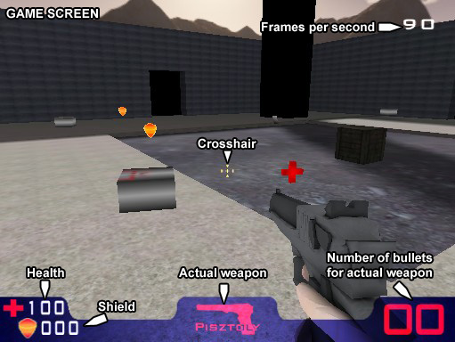
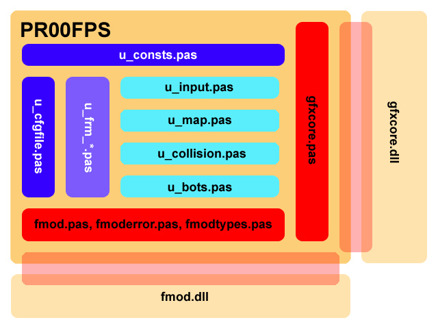

# PR00FPS

## Summary

PR00FPS game written in Delphi in 2007

Some dlls and data directory is not uploaded. However they can be acquired by installing the game. One location is: https://www.indiedb.com/games/pr00fps

Source code of the original tmcsgfxlib graphics library used by PR00FPS is here:
https://github.com/proof88/tmcsgfxlib2

## Intro

Let's start right with the name! Why PR00FPS? Well, my nickname is usually proof88 or PR00F. And because the game is an FPS game, the name of my FPS became: PR00F + FPS = PR00FPS!

I've started learning OpenGL in 2006. This is a graphics API, VGA drivers implement it and it's good because we get hardware-accelerated graphics, like with Direct3D. I was reading tutorials on the internet and tried to understand them. I have always been interested in game developing. After secondary school I went to a computer programming vocational training where I had to make a project. I already knew in the beginning of the training that my project would be a game. At first, I wanted to make simple shooting game like Wolfenstein 3D but a little bit later I thought that adding mouselook and other things to the game like jumping is not a big deal.

## Game Mechanics

I think I got to know Counter-Strike in 2002, first 1.5 and a little bit later 1.6. I have been playing CS for years but then I shifted to Quake 3. And through the years, there had been periods in my life when I played CS, and other periods when I played Quake 3, and these periods were periodically exchanged. During the above-mentioned vocational training I was in the Quake3-period so I wanted to create a game like Quake 3 rather than CS.

### Gameplay

After successfully loading the game, we spawn on the map and you can play the game. You have to shoot the enemies. When you die, the game displays the frag table until your mouseclick. After a click, you get respawned at a random location on the map. This happens to every other player, too. Every player gets as much frag as they can. If you kill somebody, you get +1 frag. If you fall out of the map or kill yourself, you get -1 frag. If it's a team game, your teammates have bluish color and enemies have reddish color. If it's Gauss-elimination mode, Gauss is the only enemy and it has yellowish color. If the game reaches its goal, frag or time limit, the game shows the frag table and the winner is the topmost player in the table. If you click, the game restarts, everybody will have 0 frag and 0 death again.

If you press ESC during game, the in-game menu shows up. I won't describe it because I think it's very straightforward.

  

### Players

There are 2 types of players apart from the player sitting in front of the computer: **snails and robots**. Why these? Well, my old graphics library doesn't support model animation so I had to think of enemies which don't need animation, so I came up with the idea of sliding snails and floating robots. Snails fire rockets, robots fire with machine guns. They have unlimited ammo but they don't pick up items. Enemies fire at each other not just the player.

### Weapons

There are 3 weapons in the game: **pistol, machine gun, bazooka**.
Every weapon has its own ammo. You can have a maximum of 99 ammo for each weapon. You have every weapon by default but you have only 8 bullets in your pistol. Pistol and machine gun doesn't need reloading but the bazooka can hold only 5 rockets at a time so you have to reload that sometimes. It's recommended to turn on optical drive interactivity in settings for more game experience . :)

### Pick-up-able items

Items on the map can be picked up by the player. Robots and snails don't pick up items. Items float in their place and rotate slowly. The **red cross** increments health by 25. The **yellowish shield** increments shield by 50. **Pistol magazine** holds 8 bullets, **machine gun magazine** holds 30 bullets. The **big rotating boxes** contain rockets, 5 rockets in each box. The **blue T character** item gives you the ability to teleport from the current location to another randomly selected location on the map by pressing E - useful when you have to flee from a nasty situation. You can use teleport once after picking it up. The **4x item** gives you quad damage so every hit will hurt the enemy 4 times. Quad damage lasts only for a short period of time (if I remember correctly, 30 seconds) or until we die.
Every item gets respawned after a short period of time at the same place after picking it up.

## Code Structure

I used Delphi because I had the most routine in Delphi at that time. The game uses [tmcsgfxlib2 library](https://github.com/proof88/tmcsgfxlib2) compiled into gfxcore.dll for the rendering. The advantage of this structure is that I can modify the graphics library without rebuilding the game, and I can modify the game without rebuilding the graphics library, and I can use this library in my other projects, too.

Delphi supports object oriented programming but I didn't use it. The whole game looked like this: the main program used a lot of units, every window (form) had its own unit, and separate units contained the collision detection functions, map handling functions, etc. But there weren't any classes, just type definitions. For example, there wasn't a map class, instead of that, there was a TMap record containing map-related data and every map-related function had the prefix "map", for example, mapLoadMap() loaded the given map, mapFlush() removed it from memory. So the whole game was written using functions and records, which is a little strange but that's all I could do at that time.

  

The graphics library doesn't contain much optimization related to rendering. That's why the game can be said to be slow but it isn't as slow as expected because the polygon number is low and the maps are small. The library doesn't decide whether an object is behind you or behind the walls, it draws it anyway. That's why the maps are so small. But the game still ran okay on school computers. Texture compression helped a lot. This means if the hardware supports texture compression then textures are stored in a compressed format in video memory. This can boost up performance significantly with integrated video chips, too.

At the end of development I realised sounds should be added to the game. I used FMOD library for that. Sadly there wasn't much time left for that, so sounds were just quickly added to the game and the development had to be finished at the end of last semester. I'm not satisfied, some sounds are strange, sometimes they come from the right or the left when they should come from both sides and quality of sounds should be better, too.

